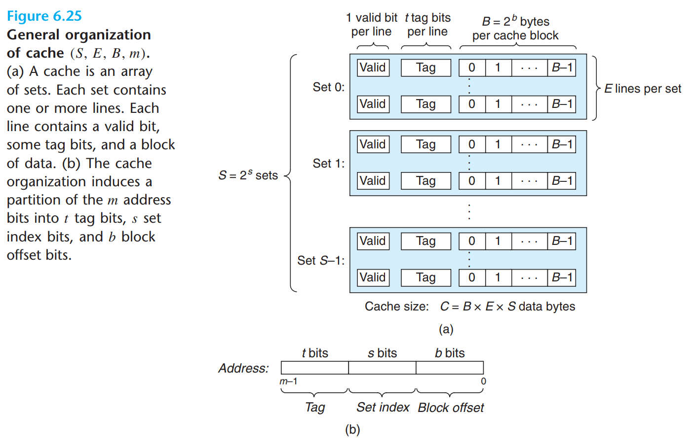

## <center>ICS (Architecture)</center>

### <center>Fudan University / 2020 Spring</center>

<center>Assignment 3 Part I (Cache)</center>

You are required to add Cache and Branch Predictor to your MIPS Pipeline Processor in assignment 3. Due to its work and doc, assignment 3 is divided into two parts. The first part is about Cache, and the latter one is about Branch Predictor.

The first part will make up 25% of the final score. It will **due on May 11**, and you must pass all the tests (cpu_tb.sv is to be delayed) before submitting your work. And recently we've made some **changes** to checker, please refer to [checker guidelines](https://github.com/SunflowerAries/ICS-Spring20-Fudan/blob/master/README.md#checker-configuration) for details (If you've seen this in assignment-2, you can just ignore this).

In Part I, you may recall what you've learned from ICS about cache and follow this doc to implement both instruction cache and data cache. Before work, you need import codes in `src/`.

#### Description



In the above picture, the 32-bit address is divided into three parts: *Tag*, *Set index*, *Block offset*. And we define the widths of each part as `CACHE_T`, `CACHE_S` and `CACHE_B` in `cache.vh`. We also get `CACHE_E` in `cache.vh`, which means there are `CACHE_E` lines in one Set.

If `CACHE_B` is 4 and `CACHE_S` is 2, then each line stores 16 bytes or 4 words and there are 4 sets in one cache.

When 32-bit address is given, the cache first finds the set index `i` of that address, then it checks in `set[i]` whether there exists a line whose tag matches the tag of the address. If so, the cache hits or else the cache misses and we need to load a block of data from the memory into the cache line.

In the real world, memory can provide at most 32 bits of data in one clock cycle on a 32-bit processor. So if we want to read a block of data from memory, we need plenty of clock cycles to get all of them.

Under cache miss, if the selected set is full of valid lines and we choose a dirty line to be replaced, we should first write data back to memory and load new data into this line.

To do those above, you'd better use *Finite State Machines*(FSMs) in the cache. 

#### Cache Module

Our cache module will act like a bridge between MIPS processor and the memory. You need to implement `cache` module defined below. Besides, you may need to block your processor during the cache miss.

`cache.v`:

```verilog
`include "cache.vh"

/**
 * NOTE: The sum of TAG_WIDTH, SET_WIDTH and OFFSET_WIDTH should be 32
 *
 * TAG_WIDTH    : (t) tag bits
 * SET_WIDTH    : (s) set index bits, the number of sets is 2**SET_WIDTH
 * OFFSET_WIDTH : (b) block offset bits
 * LINES        : number of lines per set
 *
 * stall        : inorder to synchronize instruction memroy cache and data memroy cache, you may need this so that two caches will write data at most once per instruction respectively.
 *
 * input_ready  : whether input data from processor are ready
 * addr         : cache read/write address from processor
 * write_data   : cache write data from processor
 * w_en         : cache write enable
 * hit          : whether cache hits
 * read_data    : data read from cache
 *
 * maddr        : memory address 
 * mwrite_data  : data written to memory
 * m_wen        : memory write enable
 * mread_data   : data read from memory
 */
module cache #(
	parameter TAG_WIDTH    = `CACHE_T,
		      SET_WIDTH    = `CACHE_S,
		      OFFSET_WIDTH = `CACHE_B,
		      LINES        = `CACHE_E
)(
	input         clk, reset, stall,

	// interface with CPU
	input input_ready,
	input [31:0]  addr, write_data,
	input         w_en,
	output        hit,
	output [31:0] read_data,

	// interface with memory
	output [31:0] maddr, mwrite_data,
	output        m_wen,
	input [31:0]  mread_data
	/* input         mready // memory ready ? */
);

/**
 * TODO: Your code here
 */

endmodule
```

`cache.vh`:

```verilog cache.vh
`ifndef CACHE_VH
`define CACHE_VH

`timescale 1ns / 1ps

`define ADDR_WIDTH 32

// tag bits
`define CACHE_T 26
// set index bits
`define CACHE_S 2
// block offset bits
`define CACHE_B 4
// The sum of above bits should be 32 (ADDR_WIDTH)

// number of lines per set
`define CACHE_E 4

`define SET_NUM 2**`CACHE_S
`define BLOCK_SIZE 2**`CACHE_B

`endif
```

You'd better review *6.4 Cache Memories* in CSAPP first and understand how `cache` `set` and `line` modules should be organized (*PS*: you'd better also create a module for Line Replacement Strategy). You can refer to module declarations listed below. 

**Hint**: declarations below are for reference only. You may modify them (e.g. exposed ports) according to your way to implement cache (and we think there should be **no changes to cache.v** because we think all the ports are musts and we should set up these ports to ease our testing).

#### Reference Implementation

##### Structure

Below is the structure of `cache` module. `cache_controller`, `replacement_controller`, `set`, `line` modules are instantiated directly or indirectly in `cache`.

```
cache
+-- cache_controller
+-- set[0]
|   +-- replacement_controller
|   +-- line[0]
|   +-- line[1]
|   +-- line[2]
|   +-- line[3]
+-- set[1]
+-- set[2]
+-- set[3]
```

In `cache` module, there are several sets and a `cache_controller` which is implemented with FSMs to control the cache.

`cache_controller` will provide control signals and you need to send these control signals to the corresponding cache set (decided by the set index of address from processor), and in that cache set, control signals needed by `line` should be assigned to the correct cache line (line's tag matches the tag of address).

Every `set` instantiate a `replacement_controller`. If cache misses and the set is full, `replacement_controller` in the set will select one line to kick off. Besides, you should make sure the replacement strategy in `replacement_controller` updates its states correctly.

##### Line

```verilog
`include "cache.vh"
/**
 * w_en: write enable
 */
module line #(
	parameter TAG_WIDTH    = `CACHE_T,
		      OFFSET_WIDTH = `CACHE_B
)(
	input                        clk, reset,
	input  [OFFSET_WIDTH - 3:0]  offset,
	input                        w_en, set_valid, set_dirty,
	input  [TAG_WIDTH - 1:0]     set_tag,
	input  [31:0]                write_data,
	output reg                   valid,
	output                       dirty,
	output reg [TAG_WIDTH - 1:0] tag,
	output [31:0]                read_data
);

/**
 * TODO: Your code here
 */

endmodule
```

The `line` module behaves quite like `dmem` except that there are extra properties(registers) and corresponding control signals like `valid`, `dirty`, `tag` and `set_valid`, `set_dirty`, `set_tag`.  
If `w_en` is 1, not only will `write_data` be written into `line`, but also `set_valid`, `set_dirty` and `set_tag` will be assigned to `valid`, `dirty` and `tag` registers in this clock cycle. If `w_en` is 0, nothing will be changed in `line`.

##### Set

```verilog
`include "cache.vh"
/**
 * ctls       : control signals from cache_controller
 * addr       : cache read/write address from processor
 * write_data : cache write data from processor
 * mread_data : data read from memory
 * 
 * hit        : whether cache set hits
 * dirty      : from the cache line selected by addr (cache line's tag is equal to addr's tag)
 */
module set #(
	parameter TAG_WIDTH    = `CACHE_T,
		      OFFSET_WIDTH = `CACHE_B,
		      LINES        = `CACHE_E
)(
	input                         clk, reset,
	input  [4 + OFFSET_WIDTH-2:0] ctls,
	input  [31:0]                 addr, write_data, mread_data,
	output                        hit, dirty,
	output [31:0]                 read_data
);

wire w_en, set_valid, set_dirty, init, offsetSW;
wire [OFFSET_WIDTH - 3:0] offset;

// control signals will be assigned to the target line instance.
assign {w_en, set_valid, set_dirty, offset, strategy_en, offset_sel} = ctls;

/**
 * TODO: Your code here
 */

endmodule
```

`set` module will instantiate several `line` modules. To conveniently instantiate an array of custom modules, follow [this link](https://stackoverflow.com/questions/1378159/can-we-have-an-array-of-custom-modules) for more details. Besides, you'd better use a *Line Replacement Strategy* module(`replacement_controller`) in `set` module. 

The `ctls` are control signals from `cache_controller` and part of them should be sent to cache line whose tag matches address's tag.

In `ctls`, `strategy_en` is the enable signal of Line Replacement Strategy. The reason why we need it is that there may be lots of clock cycles in one cycle of cache read/write, and some replacement strategy (eg. LFU) may be affected if the strategy runs in every clock cycle.

`offset_sel` is used to select from `mread_data` and `write_data`. The selected data will be written into `line` as `write_data`.

##### Cache Controller

```verilog
/**
 * en         : en in cache module
 * cw_en      : cache writing enable signal, from w_en in cache module
 * hit, dirty : from set module
 *
 * w_en       : writing enable signal to cache line
 * mw_en      : writing enable signal to memory , controls whether to write to memory
 * set_valid  : control signal for cache line
 * set_dirty  : control signal for cache line
 * offset_sel : control signal for cache line and this may be used in other places
 */
module cache_controller #(
	parameter OFFSET_WIDTH = `CACHE_B
)(
	input  clk, reset, en, cw_en, hit, dirty, // mready,
	output w_en, set_valid, set_dirty, mw_en,
	output [OFFSET_WIDTH - 3:0] block_offset,
	output strategy_en,
	output reg offset_sel
);

/**
 * TODO: Your code here
 */

endmodule
```

Personally, I suggest you use two FSMs. One is used to count on offset. The other records the action state of cache: `ReadMem`(read block from memory), `WriteBack`(write block to memory), `Initial`(initial state), etc. Also you should notice that there are connections between these two FSMs. For example, `WriteBack` will change to `ReadMem` only when offset is certain value.

#### Report Requirements

- There's no need to include simulation results (e.g. wave plots) in your report, since you have passed all the benchtests.
- You need state how your cache works and draw the state diagram and state-transition table by yourself and include them in your report.
- For the sake of intellectual property, you should list all the references, especially the pictures you include in the report (It's recommended to draw pictures on your own).

- You are encouraged to implement a parameter-defined cache (15% bonus). Otherwise, please implement 4-way associative cache with 4 sets and each of line stores 16 bytes.
- You are encouraged to offer some interesting and useful benchtests used for cache (not included in ours) in your report (no more than 5% bonus).

