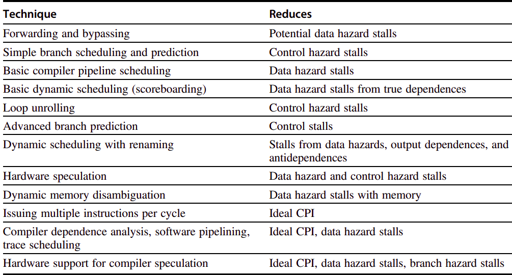

## <center>ICS (Architecture)</center>

### <center>Fudan University / 2020 Spring</center>

<center>Assignment 3 Part II (Branch Prediction)</center>

> There are only two hard things in Computer Science: cache invalidation and naming things.
>
> ​																							-- Phil Karlton[^Skeptics]

[^Skeptics]:https://skeptics.stackexchange.com/questions/19836/has-phil-karlton-ever-said-there-are-only-two-hard-things-in-computer-science

After Part I of the assignment-3, I think you've got some clues about what the saying is talking about. Then in Part II, you are required to add branch predictor to your MIPS Pipeline Processor, which in some way is another kind of cache, recording the choices about branch to help predict the future, thus decreasing the waste of the CPU cycles.

This part will make up 15% of the final score. It will **due on June 1**, and you must pass all the tests (cpu_tb.sv is to be delayed) before submitting your work. Recently we've made some **changes** to checker, please refer to [checker guidelines](https://github.com/SunflowerAries/ICS-Spring20-Fudan/blob/master/README.md#checker-configuration) for details (If you've seen this in assignment-2, you can just ignore).

In Part II, you need have a look at the related chapters in *Computer Architecture: A Quantitative Approach*[^CAAQA] (e.g. 3.3 Reducing Branch Cost With Advanced Branch Prediction, Appendix C) about branch predictor and follow this doc to implement one. Before work, you need import codes in `src/`.

[^CAAQA]:https://www.amazon.com/Computer-Architecture-Quantitative-John-Hennessy/dp/012383872X

#### Background

Now recall the value of the CPI (Cycles per Instruction), we'll have a deeper image:

Pipeline CPI = Ideal pipeline CPI + Structural stalls + Data hazard stalls + Control stalls[^CAAQA]

There are so many items contributing to the final CPI and engineers (and scientists) have explored so many techniques to improve them by the sophisticated design of CPU and the interesting interaction with Compiler and so on.



In assignment-2, we've taken advantage of some techniques to improve our CPU, such as forwarding and bypassing, or even simple branch scheduling and prediction to decrease the CPI (due to the inherent features of our programs, always taken may have round a 60% success rate[^ICS]).

[^ICS]:http://csappbook.blogspot.com/

However, that's still far from how the industry is doing, since for typical RISC programs, the average dynamic branch frequency is often between 15% and 25%, meaning that 3-6 instructions execute between a pair of branches[^CAAQA]. When we only consider the stalls caused by branch, we will have at least 1 + 0.4 \* 0.2 = 1.08 CPI, while state-of-the-art pipeline with BPB can have 90% accuracy (do not consider the hit rate), which means we can get 1 + 0.1 \* 0.2 = 1.02 CPI based on the classic 5-stage pipeline. With the introduction of Superscalar and IPC (Instructions per cycle), the performance differential may even grow larger.

Although branch predictor is promising, it also incurs new challenge. 
$$
\mbox{CPU time} = \frac{\mbox{Seconds}}{\mbox{Program}} = \frac{\mbox{Instructions}}{\mbox{Program}}\times\frac{\mbox{Clock cycles}}{\mbox{Instruction}}\times\frac{\mbox{Seconds}}{\mbox{Clock cycles}}
$$
Modern architecture's depth has been designed as more than 5 stages to lower the third item, thus leading to the extremely high misprediction penalty. Take the Intel Core i7 pipeline structure as an example, the total pipeline depth is 14 stages, with branch mispredictions typically costing 17 cycles[^CAAQA]. To obtain better performance, thus we need more sophisticated branch prediction mechanisms. 

**Hint**: In this part, you have to at least design a 2-bit predictor scheme, while other strategies are also welcomed.

#### BPB Module

Our BPB offers another choice for the update of PC, meanwhile, BPB should watch cautiously how CPU is going. You need to implement `bpb` module defined as below. 

```verilog
`include "bpb.vh"

/**
 * ENTRIES          : number of entries in the branch predictor buffer
 * TAG_WIDTH        : index bits
 * instr_adr        : if this address has been recorded, then CPU can go as the BPB directs
 * isbranch         : in order to register the branch when first meeted
 * real_taken       : whether this branch should be taken according to the semantics of the instructions
 * real_adr         : where should this branch jumps to
 * predict_taken    : whether this branch should be taken according to the prediction of our BPB
 * predict_adr      : where should this branch jumps to if it's taken
 */
module bpb #(
    parameter ENTRIES = `BPB_E,
    parameter TAG_WIDTH = `BPB_T
) (
    input                   clk, reset, stall, flush,
    input [TAG_WIDTH-1:0]   instr_adr,
    
    input                   isbranch,
    // reality
    input                   real_taken,
    input [31:0]            real_adr,
    // prediction
    output reg              predict_taken,
    output reg [31:0]       predict_adr
);

/**
 * TODO: Your code here
 */

endmodule
```

I recommend you to design a structure like `cache` which can scale well when we change the parameters, and separating the controller module out can give you more flexibility to change your strategy. Due to its simplicity, we will not give further setting, and it's your time to design.

#### Report Requirements

- There's no need to include simulation results (e.g. wave plots) in your report, since you have passed all the benchtests.
- You need state how your predictor works and draw the state diagram and state-transition table by yourself and include them in your report.
- For the sake of intellectual property, you should list all the references, especially the pictures you include in the report (It's recommended to draw pictures on your own).

- You are encouraged to implement a parameter-defined predictor (5% bonus) and to implement different prediction mechanisms (15%) and run benchtests to test the performance and give analysis.
- You are encouraged to offer some interesting and useful benchtests used for BPB (not included in ours) in your report (no more than 5% bonus).

